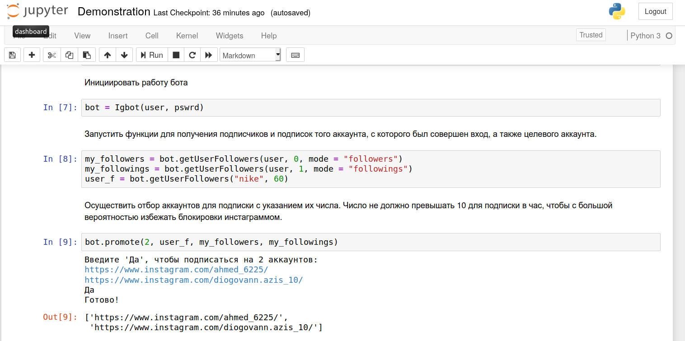
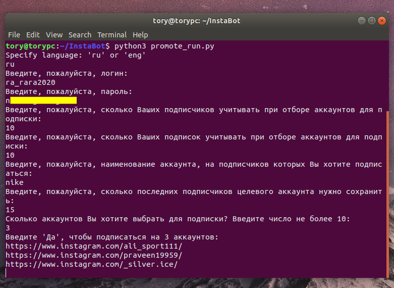

# InstaBot
Selenium In$sta9ram scrapper is meant to perform several functions:
* login (both in headless and not modes)
* collect a list of followers or followings of a user
* choose randow N accounts to follow (without violation of daily limits set by service)
* perform following chosen account
* perform unfollowing unmutual followings

----Prerequisites------

* Chrome
* `pip install -r requirements.txt`

To use first run in home directory 
`git clone "https://github.com/vtorygit/InstaBot.git"`

navigate to the folder InstaBot (like `cd InstaBot`)

launch jupyter notebook or run the python file

Using jupyter notebooks
---------

launch anaconda, navigate to the folder jupyter_notebook and start the file Demonstration.ipynb or it's copy in the same  (jupyter_notebook) directory.

Running python scripts to perform several functions
----------
### Follow

navigate to the folder InstaBot (like `cd InstaBot`)

run `python3 promote_run.py`

and insert all information required

----------

The repository also has a folder called `Trash` (or I'll make it later anyway). It's the history of dev of second version of bot, that turned out to be incompetible with newest In$ta9ram rulles because bot is being recognised and blocked too quickly. Anyway, it has some code features I want to store somethere, as they can be applied later in other works

